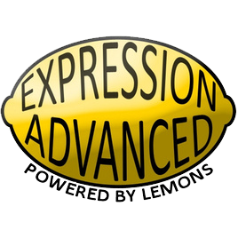

# Expression Advanced Wiki

Current revision: **2.0**.

## What is Expression Advanced 2?

**Expression Advanced 2** the successor to the LemonGate. It is no longer a WireMod derived addon and thus no longer requires WireMod to be installed. The purpose of Expression Advanced 2 is to add an in-game scriptable entity and screen to Garry's Mod.

This video will help explain: https://www.youtube.com/watch?v=5GQ4ls8pLqg.

## Credits

- [Rusketh](http://github.com/Rusketh) - Lead Developer.
- [Oskar94](http://github.com/oskar94) - Co Developer.
- [Divran](https://github.com/Divran) - Sub Developer.
- [Syranide](https://github.com/syranide) - Helper, Compiler heavily based around his work used in E2.
- [Mandrac](https://github.com/mandrac) - Modeler.
- [Omicron](https://github.com/OmicroNiuM) - Modeler.
- Shadowscion - Modeler.
- [Vercas](https://github.com/vercas) - Vercas' Object Notation & Vercas' Net ([thread](http://www.facepunch.com/showthread.php?t=1194008)).
- [Yusuke Kamiyamane](http://p.yusukekamiyamane.com/) - Some icons from the Fugue and Diagona icon packs. Licensed under a Creative Commons Attribution 3.0 License.
- [VINTproYKT](https://github.com/VINTproYKT) - Wiki.