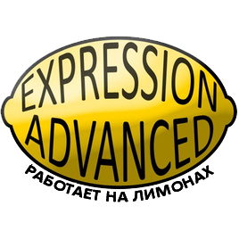

# Вики Expression Advanced

Текущая версия: **2.0**.

## Что такое Expression Advanced 2?

**Expression Advanced 2** - это продолжитель Lemon-Gate. Теперь это аддон не унаследованный и более не нуждающийся в WireMod.

Предназначение Expression Advanced 2 состоит в добавлении внутриигровых программируемых предметов и экранов в Garry's Mod.

В остальном поможет это видео: [ссылка на YouTube](https://www.youtube.com/watch?v=5GQ4ls8pLqg Большой обзор Expression Advanced 2).



## Авторы

- [Rusketh](http://github.com/Rusketh) - Ведущий разработчик.
- [Oskar94](http://github.com/oskar94) - Со-разработчик.
- [Divran](https://github.com/Divran) - Суб-разработчик.
- [Syranide](https://github.com/syranide) - Помощник; компилятор по большей части основан вокруг его работы, использованной в E2.
- [Mandrac](https://github.com/mandrac) - Модельщик.
- [Omicron](https://github.com/OmicroNiuM) - Модельщик.
- Shadowscion - Модельщик.
- [Vercas](https://github.com/vercas) - Vercas' Object Notation & Vercas' Net ([статья](http://www.facepunch.com/showthread.php?t=1194008)).
- [Yusuke Kamiyamane](http://p.yusukekamiyamane.com/) - Некоторые иконки из пакетов Fugue и Diagona. Лицензия: [Creative Commons Attribution 3.0 License](http://creativecommons.org/licenses/by/3.0/).
- [VINTproYKT](https://github.com/VINTproYKT) - Вики.